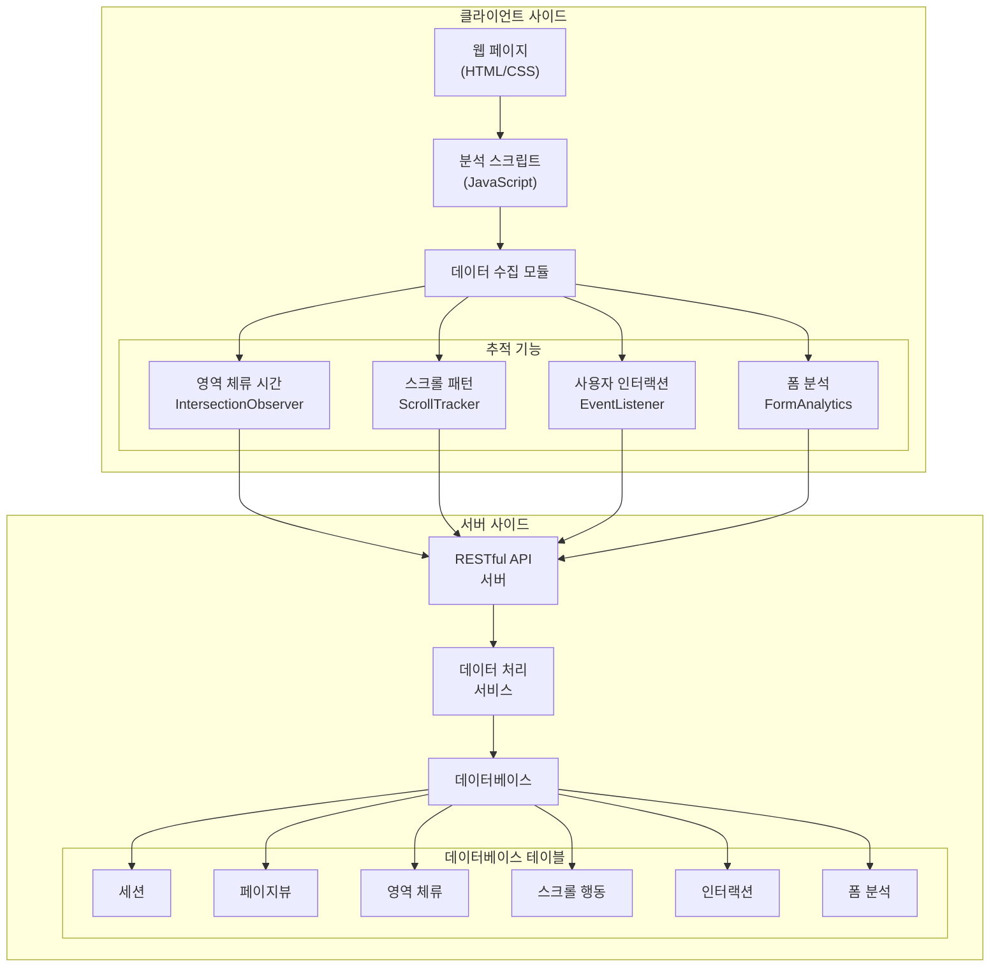

# User Behavior Analytics

사용자 행동 분석을 위한 웹 기반 도구입니다. 이 프로젝트는 웹사이트 사용자의 행동을 추적하고 분석하여 의미 있는 인사이트를 제공합니다.

## 시스템 아키텍처



## 주요 기능

- **영역 기반 분석**: 웹페이지의 특정 영역별 사용자 체류 시간과 상호작용을 추적
- **스크롤 패턴**: 사용자의 스크롤 행동과 깊이를 분석
- **인터랙션 추적**: 클릭, 마우스 이동 등 사용자 상호작용 데이터 수집
- **폼 분석**: 폼 작성 행동과 완료율 분석

## 기술 스택

### 클라이언트
- HTML5
- CSS3
- JavaScript (ES6+)
- IntersectionObserver API
- DOM Events API

### 서버
- RESTful API
- 데이터베이스 (PostgreSQL/MariaDB)

## 설치 방법

1. 저장소 클론
```bash
git clone https://github.com/whwnddml/user-behavior-analytics.git
```

2. 의존성 설치
```bash
cd user-behavior-analytics
npm install
```

3. 환경 설정
- `.env` 파일 생성
- 데이터베이스 연결 정보 설정

4. 서버 실행
```bash
npm start
```

## 사용 방법

1. 분석하고자 하는 웹페이지에 스크립트 추가:
```html
<script src="path/to/analytics.js"></script>
```

2. 영역 정의:
```html
<div class="area" data-area-id="main-content">
    <!-- 콘텐츠 -->
</div>
```

3. 데이터 수집 시작:
```javascript
Analytics.init({
    projectId: 'your-project-id',
    // 추가 설정...
});
```

## 데모

프로젝트 데모는 다음 URL에서 확인할 수 있습니다:
https://whwnddml.github.io/user-behavior-analytics/

## 라이선스

이 프로젝트는 MIT 라이선스를 따릅니다. 자세한 내용은 [LICENSE](LICENSE) 파일을 참조하세요.


참고
https://mermaid.live/

